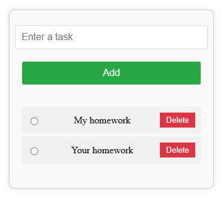

# To-Do List

This project creates a simple To-Do List application using JavaScript and HTML. Users can add tasks to the list and remove completed tasks.



## Features

- Add tasks
- Delete tasks
- Automatically truncate long task texts
- User-friendly interface

## Technologies Used

- HTML
- CSS
- JavaScript

## Setup

1. **Clone or download this repository:**

   ```bash
   git clone https://github.com/your-username/todo-list.git
   cd todo-list
   ```

2. **Open the project files in a web browser:**

   - Open the `index.html` file in your web browser to view the project.

## Usage

- **Add a Task:** Enter a task in the input field and click the "Add" button or press the Enter key.
- **Delete a Task:** Click the "Delete" button next to the task you want to remove.

## Code Overview

### HTML (`index.html`):

```html
<!DOCTYPE html>
<html lang="en">
  <head>
    <meta charset="UTF-8" />
    <meta name="viewport" content="width=device-width, initial-scale=1.0" />
    <link rel="stylesheet" href="style.css" />
    <title>To-Do List</title>
  </head>
  <body>
    <!-- JavaScript will dynamically create the form here -->
    <script src="script.js" defer></script>
  </body>
</html>
```

### JavaScript (`script.js`):

```javascript
"use strict";
document.addEventListener("DOMContentLoaded", () => {
  // Create container
  const div = document.createElement("div");
  div.classList.add("container");

  // Create input field
  const input = document.createElement("input");
  input.type = "text";
  input.placeholder = "Enter a task";
  input.classList.add("input");

  // Create task list
  const ul = document.createElement("ul");
  ul.classList.add("list");

  // Create add button
  const button = document.createElement("button");
  button.type = "submit";
  button.classList.add("button");
  button.textContent = "Add";

  // Add task function
  function addTask() {
    if (input.value.trim() === "") {
      return; // Prevent adding empty tasks
    }

    const li = document.createElement("li");

    // Create radio button
    const radio = document.createElement("input");
    radio.type = "radio";
    radio.name = "radio";
    radio.value = "radio";
    radio.classList.add("radio");

    // Task text
    const taskText = document.createElement("span");

    const MAX_LENGTH = 50; // Maximum text length
    let taskValue = input.value;
    if (taskValue.length > MAX_LENGTH) {
      taskText.title = taskValue; // Add full text as tooltip
      taskValue = taskValue.substring(0, MAX_LENGTH) + "...";
    }
    taskText.textContent = taskValue;

    // Create delete button
    const deleteButton = document.createElement("button");
    deleteButton.type = "button";
    deleteButton.classList.add("delete-button");
    deleteButton.textContent = "Delete";
    deleteButton.addEventListener("click", () => {
      li.remove();
    });

    li.appendChild(radio);
    li.appendChild(taskText);
    li.appendChild(deleteButton);
    ul.appendChild(li);

    input.value = "";
  }

  // Add click event listener to button
  button.addEventListener("click", addTask);

  // Add enter key listener to input field
  input.addEventListener("keypress", (event) => {
    if (event.key === "Enter") {
      addTask();
    }
  });

  // Append elements to container
  div.appendChild(input);
  div.appendChild(button);
  div.appendChild(ul);

  // Append container to body
  document.body.appendChild(div);
});
```

### CSS (`style.css`):

```css
.container {
  display: flex;
  flex-direction: column;
  align-items: center;
  gap: 10px;
  padding: 20px;
  border: 1px solid #ccc;
  border-radius: 8px;
  box-shadow: 0 0 10px rgba(0, 0, 0, 0.1);
  width: 300px;
  margin: 20px auto;
  background-color: #f9f9f9;
}

.input,
.button {
  width: 100%;
  padding: 10px;
  margin: 5px 0;
  border-radius: 4px;
  border: 1px solid #ddd;
  font-size: 16px;
}

.button {
  background-color: #28a745;
  color: white;
  cursor: pointer;
}

.button:hover {
  background-color: #218838;
}

.list {
  list-style-type: none;
  padding: 0;
  width: 100%;
}

.list li {
  display: flex;
  align-items: center;
  justify-content: space-between;
  background-color: #f1f1f1;
  padding: 10px;
  border-radius: 4px;
  margin: 5px 0;
  overflow: hidden;
  text-overflow: ellipsis;
  white-space: nowrap;
}

.list li span {
  display: block;
  overflow: hidden;
  text-overflow: ellipsis;
  white-space: nowrap;
  max-width: 200px; /* Adjust width as needed */
}

.list .radio {
  margin-right: 10px;
}

.delete-button {
  background-color: #dc3545;
  color: white;
  border: none;
  padding: 5px 10px;
  cursor: pointer;
}

.delete-button:hover {
  background-color: #c82333;
}
```

## Screenshots

Include a screenshot of the To-Do List here if possible.

## Contributing

If you'd like to contribute to this project, please open an issue or submit a pull request.

## License

This project is open source and available under the [MIT License](LICENSE).

## Contact

Feel free to reach out if you have any questions or feedback.

---

Replace `your-username` in the clone command with your actual GitHub username, and consider adding a screenshot of your application to the `screenshot.png` file or updating the path as needed.
